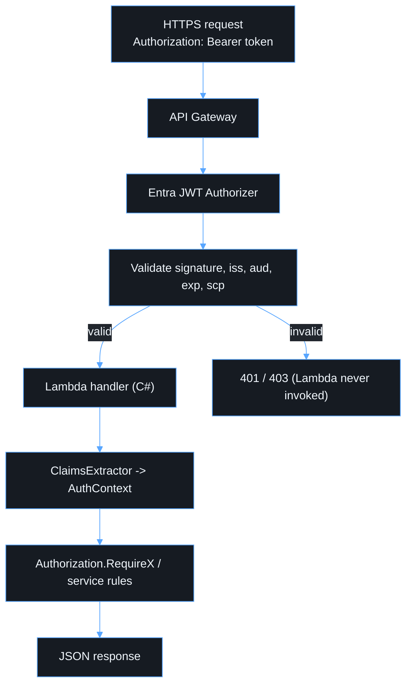

# API

## Description

Amazon API Gateway HTTP API is the public entry point. It terminates HTTPS,
enforces CORS, validates the Entra access token with a native JWT
authorizer, and only then invokes the Lambda integration. Using the native
authorizer means no custom JWT-parsing or JWKS-fetching code exists anywhere
in this repository — see [lambda.md](lambda.md#what-lambda-never-does).

## Routes

Defined in [`infra/lib/api-stack.ts`](../infra/lib/api-stack.ts):

| Route                    | Auth | Scope            | Handler               |
| ------------------------ | ---- | ---------------- | --------------------- |
| `GET /health`            | none | —                | `HealthFunction`      |
| `GET /api/me`            | JWT  | `access_as_user` | `MeFunction`          |
| `GET /api/applications`  | JWT  | `access_as_user` | `ApplicationFunction` |
| `POST /api/applications` | JWT  | `access_as_user` | `ApplicationFunction` |

### `GET /health`

Unauthenticated liveness check. Returns only a fixed status and timestamp —
never configuration, dependency details, or environment state
([`HealthFunction.cs`](../apps/api/src/App.Api/Handlers/HealthFunction.cs)).

### `GET /api/me`

A diagnostic bootstrap endpoint, not a permanent token-dump endpoint. It
proves the trust chain end to end and returns a small allow-listed identity
projection (`MeResponse`) — never the raw token or the full claim set. See
[authorization.md](authorization.md) for how the claims are shaped.

### `GET /api/applications` / `POST /api/applications`

A minimal resource demonstrating ownership-based authorization end to end —
see [authorization.md](authorization.md#worked-example-the-application-resource).
Backed by an in-memory repository
([`InMemoryApplicationRepository.cs`](../apps/api/src/App.Api/Repositories/InMemoryApplicationRepository.cs))
by design: per the plan's scope, a persistent store is introduced only when
there is a defined requirement for one, and the repository interface
(`IApplicationRepository`) is the seam a real store (e.g. DynamoDB) plugs
into without touching the service or handler.

## Cross-language contract

`packages/shared/src/api-contracts.ts` (TypeScript) and
`apps/api/src/App.Api/Models/ApiContracts.cs` (C#) describe the same wire
shapes. Because the frontend and the API are no longer the same language
(see [`adr/0002-dotnet-lambda-runtime.md`](adr/0002-dotnet-lambda-runtime.md)),
there is no compiler enforcing this parity — when either contract changes,
update both files in the same change and re-run each side's test suite. Field
names differ only in casing convention (`camelCase` in TS/JSON on the wire,
`PascalCase` in C#, serialized to `camelCase` by
[`HttpResponses.cs`](../apps/api/src/App.Api/Utils/HttpResponses.cs)'s
`JsonNamingPolicy.CamelCase`).

## Error shape

Every non-2xx response is:

```json
{
  "error": {
    "code": "FORBIDDEN",
    "message": "You do not have permission to perform this action.",
    "correlationId": "3f2504e0-4f89-11d3-9a0c-0305e82c3301",
    "details": { "name": "Name is required." }
  }
}
```

`code` is one of `VALIDATION_ERROR | UNAUTHORIZED | FORBIDDEN | NOT_FOUND |
CONFLICT | RATE_LIMITED | INTERNAL_ERROR`
([`ApiErrorCode`](../packages/shared/src/api-contracts.ts)). An unexpected
exception always becomes a generic `500 INTERNAL_ERROR` —
[`HttpResponses.FromException`](../apps/api/src/App.Api/Utils/HttpResponses.cs)
never leaks an internal exception message to the caller; it logs the real
message server-side instead (see [observability.md](observability.md)).

`correlationId` is always present so a user can quote it to support without
either side needing to expose internal details — see
[`CorrelationId.cs`](../apps/api/src/App.Api/Utils/CorrelationId.cs) and its
frontend counterpart
[`packages/shared/src/correlation.ts`](../packages/shared/src/correlation.ts).

## CORS

Configured per environment in
[`infra/lib/config/environments.ts`](../infra/lib/config/environments.ts)
(`corsOrigins`) — never a wildcard for this authenticated API. Development
allows `http://localhost:5173`; production allows only the deployed frontend
domain.

## Request lifecycle


