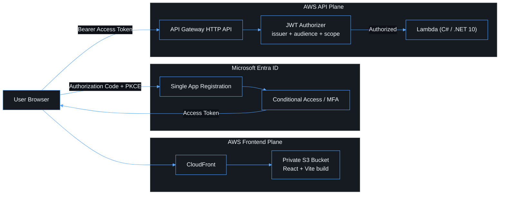

# Architecture

## Overview

This repository implements the target architecture described in
[`Microsoft Entra ID + React Vite + AWS Lambda Architecture Plan.md`](../Microsoft%20Entra%20ID%20+%20React%20Vite%20+%20AWS%20Lambda%20Architecture%20Plan.md)
at the repository root, with one deliberate deviation: **the Lambda API is
implemented in C# on .NET 10**, not TypeScript. See
[`adr/0002-dotnet-lambda-runtime.md`](adr/0002-dotnet-lambda-runtime.md) for
the rationale. Every other decision in the plan — one Entra tenant, one app
registration, API Gateway JWT authorization, no Cognito, no Amplify, no
client secret in the browser — is implemented as written.

The system separates four concerns, each with a single owner:

| Concern                                      | Owner                      | Repository location                       |
| -------------------------------------------- | -------------------------- | ----------------------------------------- |
| User authentication                          | Microsoft Entra ID         | N/A (external)                            |
| Static frontend delivery                     | CloudFront + S3            | `apps/web`, `infra/lib/frontend-stack.ts` |
| API admission (coarse-grained authorization) | API Gateway JWT authorizer | `infra/lib/api-stack.ts`                  |
| Business logic + fine-grained authorization  | AWS Lambda (C#)            | `apps/api`                                |

## Repository layout

```text
apps/
├── web/          React + Vite + TypeScript SPA (MSAL.js)
└── api/          C# (.NET 10) Lambda handlers, App.Api.sln

packages/
└── shared/       TypeScript types/constants shared by apps/web and infra
                  (apps/api mirrors these contracts manually in C# -- see docs/api.md)

infra/            AWS CDK v2 (TypeScript): frontend, api, observability stacks
docs/             This documentation set
.github/workflows/ CI/CD pipeline
```

## Request paths

Two independent planes exist and can be deployed, scaled and rolled back
separately.



The trust chain, stated once and never re-derived elsewhere:

**Entra issues the token → API Gateway validates the token → Lambda trusts
only the validated claims API Gateway forwards to it.**

See [authentication.md](authentication.md) for the full sign-in sequence,
[security.md](security.md) for the boundary model, and
[api.md](api.md) / [lambda.md](lambda.md) for what happens once a request
reaches AWS.

## Stacks

`infra/bin/app.ts` deploys three CDK stacks per environment (`dev`, `test`,
`prod` — see [`infra/lib/config/environments.ts`](../infra/lib/config/environments.ts)):

- **`<env>-app-frontend`** ([frontend-stack.ts](../infra/lib/frontend-stack.ts)) — private S3 bucket, CloudFront with Origin Access Control, response security headers, SPA routing.
- **`<env>-app-api`** ([api-stack.ts](../infra/lib/api-stack.ts)) — HTTP API, Entra JWT authorizer, three Lambda functions, access logs, alarms.
- **`<env>-app-observability`** ([observability-stack.ts](../infra/lib/observability-stack.ts)) — a CloudWatch dashboard over the API stack's resources.

See [infrastructure.md](infrastructure.md) for details on each stack.
