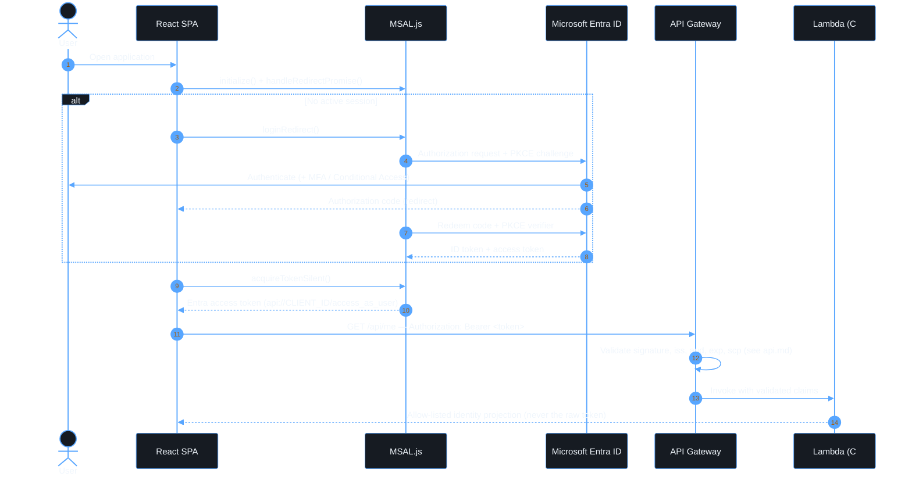

# Authentication

## Description

The React SPA is a public browser client, so it authenticates with OAuth 2.0
Authorization Code Flow with PKCE rather than any flow that requires a
confidential credential. MSAL.js owns every protocol detail — constructing
the authorization request, generating and verifying the PKCE verifier,
following the redirect, and exchanging the code for tokens. Application code
never assembles an OAuth request by hand; it calls `useAuth()`
([`apps/web/src/auth/use-auth.ts`](../apps/web/src/auth/use-auth.ts)), which
wraps `@azure/msal-react`.

## Where this lives in the frontend

```text
apps/web/src/auth/
├── auth-config.ts     Static MSAL configuration (tenant-specific authority, PKCE, no secret)
├── auth-provider.tsx  Initializes MSAL, completes the redirect, exposes the token service
├── use-auth.ts         Derives an explicit AuthStatus from MSAL's InteractionStatus
├── protected-route.tsx UX-only route guard (see security.md for why this is not a security boundary)
└── token-service.ts    acquireTokenSilent() with an interactive-redirect fallback
```

`environment.mode === 'development'` enables verbose MSAL logging; PII
logging is always disabled (`piiLoggingEnabled: false` in
[`auth-config.ts`](../apps/web/src/auth/auth-config.ts)).

## Explicit authentication states

The UI never renders protected content while session state is still being
determined. `useAuth()` derives one of five states
(`apps/web/src/auth/use-auth.ts`):

```text
initializing    MSAL is starting up or processing a redirect response
redirecting     An interactive flow (login, logout, or a token acquisition needing interaction) is in progress
authenticated   A session exists and interaction has settled
failed          Interaction settled but the last attempt recorded a failure
unauthenticated Interaction settled, no session, no recorded failure
```

`ProtectedRoute` renders a loading state during `initializing`/`redirecting`,
redirects to `/login` or `/error`, and only renders children once
`authenticated` — this avoids both a flash of protected content and a
redirect loop on page refresh.

## Sequence



## Token handling rules

- **ID tokens** are for the SPA's own understanding of the session; they are
  never sent to the API.
- **Access tokens** are the only credential sent to API Gateway, as a bearer
  token (`apps/web/src/api/api-client.ts`).
- The token cache is `sessionStorage` — scoped to the browser tab/session.
  Changing this is a security trade-off that must be recorded here if it
  ever changes.
- The bearer token is never written to `console`, analytics, or error
  trackers. `apps/web/src/api/api-client.test.ts` asserts this for thrown
  errors.

## Failure handling

`AuthProvider` subscribes to MSAL's event callback
(`ACQUIRE_TOKEN_FAILURE` covers both a failed sign-in and a failed silent
token acquisition in the installed MSAL version — see the comment in
[`auth-provider.tsx`](../apps/web/src/auth/auth-provider.tsx)) and surfaces a
friendly, actionable error with a retry action
([`login-page.tsx`](../apps/web/src/pages/login-page.tsx),
[`error-page.tsx`](../apps/web/src/pages/error-page.tsx)).
