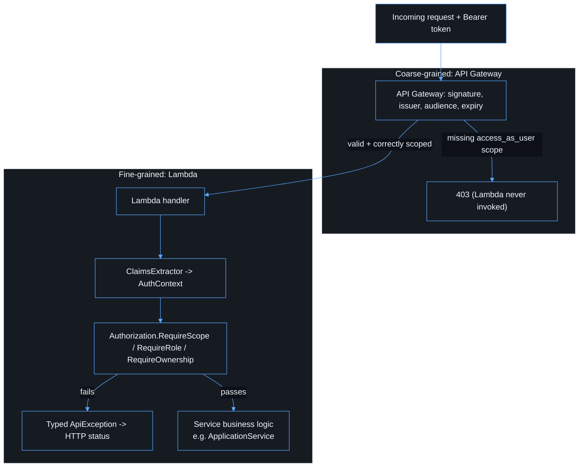

# Authorization

## Description

A valid, correctly scoped Entra token proves who the caller is and that the
token was intended for this API. It does not, by itself, decide whether that
caller may perform a specific business operation. This document covers the
two authorization layers that sit after authentication:
API Gateway's coarse-grained scope check, and Lambda's fine-grained business
authorization. See [security.md](security.md) for how these fit alongside
Entra in the overall boundary model.



## Coarse-grained: API Gateway scope check

`infra/lib/api-stack.ts` requires the `access_as_user` scope on every
protected route (`/api/me`, `/api/applications`). A structurally valid token
signed by the right tenant but missing this scope is rejected with `403`
before Lambda runs — see [api.md](api.md).

## Fine-grained: Lambda business authorization

Claims API Gateway has already validated are shaped into a typed
`AuthContext` by
[`apps/api/src/App.Api/Auth/ClaimsExtractor.cs`](../apps/api/src/App.Api/Auth/ClaimsExtractor.cs):

```csharp
public sealed record AuthContext(
    string UserId,       // oid (falls back to sub) -- stable, use for authorization
    string TenantId,      // tid
    IReadOnlyList<string> Scopes,  // scp
    IReadOnlyList<string> Roles,   // roles, if assigned
    string? DisplayName); // presentation only -- never for authorization
```

[`Authorization.cs`](../apps/api/src/App.Api/Auth/Authorization.cs) exposes
three composable, independently unit-tested checks
(`apps/api/test/App.Api.Tests/Auth/AuthorizationTests.cs`):

```csharp
Authorization.RequireScope(auth, "access_as_user");
Authorization.RequireRole(auth, "admin");
Authorization.RequireOwnership(auth, resourceOwnerId);
```

Each throws a typed `ApiException` subclass
([`Errors/ApiException.cs`](../apps/api/src/App.Api/Errors/ApiException.cs))
that the handler layer turns into the correct HTTP status — see
[api.md](api.md#error-shape).

### Handler defense in depth

Protected handlers call `Authorization.RequireScope(auth, "access_as_user")`
after claims extraction and before business logic:

- [`MeFunction.cs`](../apps/api/src/App.Api/Handlers/MeFunction.cs)
- [`ApplicationFunction.cs`](../apps/api/src/App.Api/Handlers/ApplicationFunction.cs)

`ApplicationService` also re-checks the scope on `CreateAsync` /
`ListForCurrentUserAsync`. This is intentional defense in depth: API Gateway
already rejects missing scopes with `403` before invoke, and the in-process
check ensures a misconfigured authorizer cannot silently widen access.
`MeFunctionTests` and `ApplicationFunctionTests` assert a `403` /
`FORBIDDEN` response when the claim set lacks `access_as_user`.

### Worked example: the application resource

[`ApplicationService.cs`](../apps/api/src/App.Api/Services/ApplicationService.cs)
demonstrates resource ownership end to end:

- `CreateAsync` stamps every new record with `OwnerId = auth.UserId` — a
  caller can never create a record owned by someone else.
- `ListForCurrentUserAsync` only returns records where
  `OwnerId == auth.UserId` (enforced in the repository query, not filtered
  client-side after the fact).

`ApplicationServiceTests.cs` proves this with two users creating records and
asserting each only sees their own.

## Stable vs. presentation claims

Only stable identifiers are valid authorization inputs. This is enforced by
convention (not by a runtime check) throughout `apps/api` and `apps/web`:

```text
Use for authorization:      oid, sub, tid, scp, roles
Never use for authorization: email, preferred_username, UPN, display name
```

`MeResponse.DisplayName` and `AccountInfo.name` in the frontend
(`apps/web/src/components/auth/user-menu.tsx`) are presentation-only and are
never passed into an authorization decision.

## Extending authorization

When the application needs more than ownership (e.g. team membership,
workflow state, admin-only operations), add the rule as a new, independently
testable function in `Authorization.cs` rather than an inline conditional in
a handler — this keeps authorization logic reviewable and unit-testable
separately from AWS event plumbing (see [testing.md](testing.md)).
