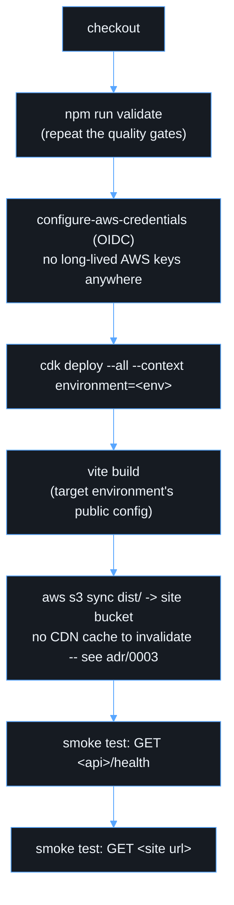

# CI/CD

## Description

The pipeline is both a delivery mechanism and a security control. Every pull
request must pass the same non-mutating checks a developer runs locally
(`npm run validate`); nothing is auto-fixed in CI. Deployment is a separate,
manually-triggered, environment-gated workflow that authenticates to AWS
with short-lived federated credentials — never long-lived AWS access keys.

## `ci.yml` — quality gates

Runs on every pull request and on pushes to `main`
([`.github/workflows/ci.yml`](../.github/workflows/ci.yml)):

```mermaid
%%{init: {
  "theme": "base",
  "securityLevel": "strict",
  "themeVariables": {
    "background": "#0d1117",
    "primaryColor": "#161b22",
    "primaryTextColor": "#f0f6fc",
    "primaryBorderColor": "#58a6ff",
    "secondaryColor": "#21262d",
    "secondaryTextColor": "#f0f6fc",
    "secondaryBorderColor": "#3fb950",
    "tertiaryColor": "#1c2128",
    "tertiaryTextColor": "#f0f6fc",
    "tertiaryBorderColor": "#d29922",
    "lineColor": "#58a6ff",
    "textColor": "#f0f6fc",
    "clusterBkg": "#161b22",
    "clusterBorder": "#30363d",
    "edgeLabelBackground": "#0d1117"
  }
}}%%
flowchart TD
    Checkout["checkout"] --> Ci["npm ci"]
    Ci --> Format["format:check<br/>Prettier + dotnet format --verify-no-changes"]
    Format --> Lint["lint (ESLint)"]
    Lint --> Typecheck["typecheck (tsc, every TS workspace)"]
    Typecheck --> Test["test<br/>Vitest: shared/web/infra + dotnet test: apps/api"]
    Test --> Build["build<br/>Vite build, tsc build for shared, dotnet build"]
    Build --> Synth["cdk synth"]

    subgraph Quality["quality job"]
        Checkout
        Ci
        Format
        Lint
        Typecheck
        Test
        Build
        Synth
        Coverage["Upload coverage artifact"]
        DepReview["Dependency review<br/>(pull requests only)"]
    end

    Synth --> Coverage
    Coverage --> DepReview

    subgraph Smoke["e2e-smoke job"]
        PW["Playwright smoke tests"]
    end

    Quality -->|"needs: quality"| Smoke
```

The `quality` job runs the same checks as `npm run validate`, so "it passed
on my machine" and "it passed in CI" mean the same thing for those steps —
see [testing.md](testing.md). CI does strictly more on top: `cdk synth` and
the `e2e-smoke` job's Playwright checks are not part of `npm run validate`
and only run in CI (or locally via `npm run synth --workspace infra` /
`npm run e2e`).

## `deploy.yml` — deployment

Manually triggered (`workflow_dispatch`) with an environment choice
(`dev`/`test`/`prod`), gated by a GitHub Environment of the same name so
`prod` can require manual approval and reviewers, independent of this
workflow file. See [deployment.md](deployment.md) for the required
variables and the AWS OIDC role setup.

A deployment is not considered complete when `cdk deploy` returns success —
the two smoke-test steps and CloudWatch alarms (see
[observability.md](observability.md)) confirm the frontend loads and the API
responds before the run is marked green.

## Artifacts

The frontend is rebuilt once per deploy run rather than promoted as an
immutable artifact across environments, because its public configuration
(`VITE_API_BASE_URL`, etc.) is environment-specific by design (see
[environment configuration](../apps/web/.env.example)). If a
build-once/promote-everywhere model is later required, inject environment
config at runtime (e.g. a small `config.json` fetched before the app boots)
rather than at build time.

## Extending this pipeline

Before enabling automatic deployment on push, add: branch protection
requiring `CI` to pass, required reviewers on the `prod` GitHub Environment,
and a rollback procedure (documented, and ideally a `cdk deploy` to the
previous commit rather than a manual console change) — see
[troubleshooting.md](troubleshooting.md).
