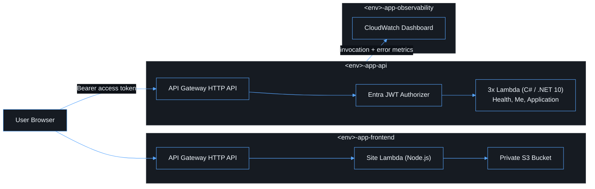

# Infrastructure

## Description

AWS CDK v2 (TypeScript) is the source of truth for every AWS resource in
this project. Stacks are separated by responsibility so a change's blast
radius is obvious from which stack it touches:
[`infra/lib/frontend-stack.ts`](../infra/lib/frontend-stack.ts) owns static
hosting, [`infra/lib/api-stack.ts`](../infra/lib/api-stack.ts) owns the API
and its Lambda functions, and
[`infra/lib/observability-stack.ts`](../infra/lib/observability-stack.ts)
owns the dashboard that reads both. `infra/bin/app.ts` wires the three
together for one environment.



## Environments

[`infra/lib/config/environments.ts`](../infra/lib/config/environments.ts)
holds only what genuinely varies between `dev`, `test` and `prod`: CORS
origins, log retention, the production removal-policy safeguard, and an
optional custom domain. Everything else is identical code across
environments. Select an environment with CDK context or an environment
variable:

```bash
npx cdk deploy --context environment=prod
# or
ENVIRONMENT_NAME=prod npx cdk deploy
```

Non-secret Entra identifiers are supplied the same way at every environment
(`ENTRA_TENANT_ID`, `ENTRA_CLIENT_ID`) — see
[entra-configuration.md](entra-configuration.md#wiring-the-identifiers-to-the-app).

## Frontend stack

```text
Private S3 bucket (Block Public Access, versioned, SSE, enforceSSL)
        |
Site Lambda (Node.js, infra/lib/site-handler) -- only this function can
read the bucket (bucket.grantRead), via the AWS SDK
  - Extension-less paths (client-side routes) always resolve to index.html,
    so they survive a browser refresh; a path with a file extension maps
    1:1 to the matching S3 key, and a genuine miss is a real 404
  - Attaches the same security headers CloudFront's ResponseHeadersPolicy
    used to: HSTS, CSP, X-Content-Type-Options, Referrer-Policy,
    frame-ancestors 'none', Permissions-Policy
  - Hashed asset paths get long-lived immutable Cache-Control; index.html
    is always no-cache
        |
API Gateway HTTP API (aws-cdk-lib/aws-apigatewayv2), Lambda proxy
integration, GET / and GET /{proxy+}
        |
Optional: regional ACM certificate + Route 53 alias, when
`environments.ts` configures a `domain` for the environment
```

The bucket is never public; only the site Lambda's execution role can read
it. There is no CDN or edge cache in front of this API -- every request is
served live by the Lambda, by design (dropped in favor of simplicity over
edge caching). See `infra/test/frontend-stack.test.ts` for the CDK
assertions (block-public-access, least-privilege IAM, the HTTP API routes)
and `infra/test/site-handler.test.ts` for the Lambda's own behavior (SPA
fallback, real 404s, the security headers).

## API stack

```text
HttpApi (aws-cdk-lib/aws-apigatewayv2)
  - corsPreflight restricted to environment.corsOrigins (never "*")
  - HttpJwtAuthorizer(issuer = https://login.microsoftonline.com/<TENANT_ID>/v2.0,
                      jwtAudience = [<CLIENT_ID>])
  - GET  /health              no authorizer
  - GET  /api/me               authorizer + authorizationScopes: ["access_as_user"]
  - GET|POST /api/applications authorizer + authorizationScopes: ["access_as_user"]
  - Access log group (JSON format: requestId, route, status, latency -- never
    the Authorization header or claims)
  - Default route throttling (burst 100 / rate 50, adjust per environment)
        |
3x AWS Lambda (C# / .NET 10) -- see lambda.md
  - One published assembly, three handler strings
  - AWSLambdaBasicExecutionRole only
  - Dedicated CloudWatch log group per function, retention from environment.logRetention
        |
CloudWatch Alarms: Lambda errors / throttles / p99 duration per function,
                    API 5xx and p99 latency
```

`infra/test/api-stack.test.ts` pins the JWT authorizer's issuer/audience,
the required scope on every protected route, the absence of an authorizer on
`/health`, restricted CORS, least-privilege IAM, log group retention, and the
existence of every alarm.

### Packaging the C# Lambda

[`infra/lib/api-lambda-bundling.ts`](../infra/lib/api-lambda-bundling.ts)
publishes `apps/api/src/App.Api/App.Api.csproj` once
(`dotnet publish -c Release --self-contained false`) and reuses the output
for all three functions. It builds locally with the installed .NET 10 SDK
when available (fast inner loop, no Docker required for `cdk synth` on a
developer machine with `dotnet` on `PATH`), and falls back to the official
`public.ecr.aws/sam/build-dotnet10` image otherwise — so CI and developers
without a local SDK still get a reproducible build. See
[deployment.md](deployment.md#prerequisites).

## Observability stack

A single CloudWatch dashboard (`ObservabilityStack`) visualizing API
request/error counts, p99 latency, and per-function Lambda invocations,
errors, throttles and p99 duration. Alarms live in the API stack, next to
the resources they protect; this stack only aggregates trends — see
[observability.md](observability.md).

## Networking

Lambda is not attached to a VPC. Nothing in this reference implementation
calls a private resource (no RDS, no private internal service), so a VPC
would only add subnet, route table, security group and NAT/endpoint
complexity with no security benefit. Attach a VPC only when a real private
resource is introduced — see the plan's Networking section for the
reasoning.

## Feature flags and warnings

`infra/cdk.json` pins the CDK feature flags this project has explicitly
reviewed (S3 access-logging via bucket policy, IAM policy minimization,
strong cross-stack references, …). `cdk synth` should produce **zero**
warnings; if a new one appears after a CDK upgrade, resolve or explicitly
acknowledge it rather than ignoring it, per the plan's "documentation is
part of the product" principle.
