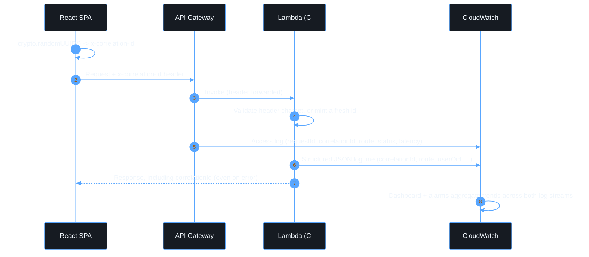

# Observability

## Description

Observability is designed to answer three questions without reproducing the
request: **Is the service healthy? What failed? Which request or deployment
caused it?** This is built from structured logs, a correlation id
propagated end to end, CloudWatch alarms, and one dashboard — not from ad
hoc `console.log`/`Console.WriteLine` calls.

## Correlation id

A single id ties a browser request to its Lambda logs. The frontend
generates one per request (`crypto.randomUUID()` in
[`apps/web/src/api/api-client.ts`](../apps/web/src/api/api-client.ts)) and
sends it as the `x-correlation-id` header. The API accepts it only if it is
safe to log — short and made of a restricted character set
([`packages/shared/src/correlation.ts`](../packages/shared/src/correlation.ts)
and its C# mirror
[`CorrelationId.cs`](../apps/api/src/App.Api/Utils/CorrelationId.cs)) —
otherwise it mints a fresh one, so a hostile header value can never be used
to inject content into logs. Every error response includes the (possibly
regenerated) correlation id so a user can quote it to support.



## Structured logs

Every Lambda invocation produces one JSON object per log line
([`Logger.cs`](../apps/api/src/App.Api/Utils/Logger.cs)):

```json
{
  "timestamp": "2026-09-14T12:00:00.000Z",
  "level": "info",
  "service": "api",
  "environment": "dev",
  "awsRequestId": "...",
  "correlationId": "...",
  "route": "GET /api/me",
  "method": "GET",
  "userOid": "...",
  "tenantId": "...",
  "message": "Resolved authenticated identity."
}
```

Never present, by convention and by a defensive denylist redaction in
`Logger.cs`: access tokens, ID tokens, `Authorization` headers, passwords,
secrets, or cookies. See [security.md](security.md#secrets-and-logging).

## API access logs

`infra/lib/api-stack.ts` sends API Gateway access logs to a dedicated
CloudWatch log group, in JSON, capturing request id, correlation id, route,
method, status, integration status, and both integration and total latency
— never the `Authorization` header or the JWT claims.

## Alarms

Defined alongside the resources they protect, in `infra/lib/api-stack.ts`:

| Alarm                        | Condition                                                       |
| ---------------------------- | --------------------------------------------------------------- |
| `<env>-<Function>-errors`    | ≥1 Lambda error in 5 min, per function                          |
| `<env>-<Function>-throttles` | ≥1 Lambda throttle in 5 min, per function                       |
| `<env>-<Function>-duration`  | p99 duration > 8s for 3 consecutive 5-min periods, per function |
| `<env>-app-api-5xx`          | ≥1 API Gateway 5xx in 5 min                                     |
| `<env>-app-api-latency`      | p99 latency > 3s for 3 consecutive 5-min periods                |

`treatMissingData: NOT_BREACHING` throughout, so a quiet period (no traffic)
never falsely alarms. `infra/test/api-stack.test.ts` asserts every alarm
exists.

## Dashboard

[`ObservabilityStack`](../infra/lib/observability-stack.ts) renders one
CloudWatch dashboard (`<env>-app-observability`) with: API request/error
counts, API p99 latency, per-function Lambda invocations, per-function
errors and throttles, and per-function p99 duration. It only visualizes
trends; alarms are the actionable signal.

## Log retention

Set per environment in
[`infra/lib/config/environments.ts`](../infra/lib/config/environments.ts)
(`logRetention`) — two weeks for `dev`, one month for `test`, six months for
`prod`. Every log group (per-function and the API access log group) uses
this value; there is no log group anywhere in this stack with the default
"never expire" retention.
