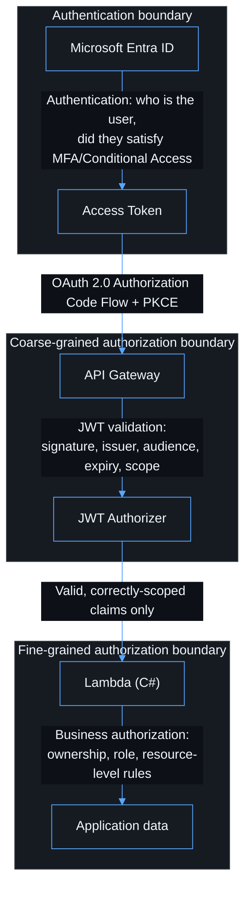

# Security

## Description

The architecture has three authorization boundaries, and this codebase keeps
them separate deliberately — collapsing them into one another is the failure
mode this document exists to prevent.



A frontend route cannot grant backend access
([authentication.md](authentication.md#explicit-authentication-states)). A
valid Entra token cannot call an API it was not issued for
([entra-configuration.md](entra-configuration.md#expose-the-api)). A valid,
correctly-scoped API token does not automatically grant access to every
record or operation ([authorization.md](authorization.md)).

## No client secret in the browser

The SPA is a public client. Nothing in `apps/web` holds a client secret, an
AWS credential, or a private key — verified by convention (no such value
exists in the frontend environment schema,
[`apps/web/src/config/environment.ts`](../apps/web/src/config/environment.ts))
and by the explicit "never place" list in `apps/web/.env.example`.

## Content Security Policy

[`infra/lib/site-handler/index.ts`](../infra/lib/site-handler/index.ts) (the
Lambda that serves the frontend from S3 — see
[`adr/0003-remove-cloudfront.md`](adr/0003-remove-cloudfront.md)) attaches
these as literal response headers on every request, with a CSP tuned for
MSAL's redirect flow against Entra:

```text
default-src 'self'
script-src 'self'
style-src 'self' 'unsafe-inline'
img-src 'self' data:
connect-src 'self' https://login.microsoftonline.com <API_ORIGIN>
frame-src 'self' https://login.microsoftonline.com
frame-ancestors 'none'
base-uri 'none'
object-src 'none'
```

`<API_ORIGIN>` is the public HTTPS origin of the API for the environment
(custom `apiDomainName` when configured, otherwise the execute-api URL).
`FrontendStack` passes it to the site Lambda as `API_ORIGIN` so CSP
`connect-src` is set at deploy time — see
`infra/lib/site-handler/index.ts` and `infra/test/site-handler.test.ts`.

`style-src 'unsafe-inline'` is a known relaxation for the current plain-CSS
setup; tighten it (nonce/hash-based) if a CSS-in-JS or inline-style approach
is introduced later. Revisit this policy whenever the production API or CDN
domain changes, and whenever a new external script or frame source is
required — treat a CSP change as a security-relevant diff, not a drive-by
edit.

Additional headers on every response: HSTS (`max-age=365d`, includeSubdomains,
preload), `X-Content-Type-Options: nosniff`, `Referrer-Policy:
strict-origin-when-cross-origin`, `X-Frame-Options: DENY`, and a restrictive
`Permissions-Policy`.

## Secrets and logging

Never logged, anywhere in this codebase (`apps/web/src/api/api-client.ts`,
`apps/api/src/App.Api/Utils/Logger.cs`):

```text
Access tokens / ID tokens
Authorization headers
Passwords, secrets, cookies
```

`Logger.cs` additionally redacts a denylist of field names as a defense in
depth measure, in case a caller ever passes one by mistake. See
[observability.md](observability.md).

## IAM

Every API Lambda execution role has exactly the AWS-managed
`AWSLambdaBasicExecutionRole` — nothing else. `infra/test/api-stack.test.ts`
fails the build if a wildcard action/resource or an extra custom policy is
ever introduced without updating that test, which forces the change to be
deliberate and reviewed. The one deliberate exception is the frontend's site
Lambda, which additionally gets read-only access to the site bucket
(`bucket.grantRead`, scoped to that one bucket) so it can serve the SPA —
pinned down in `infra/test/frontend-stack.test.ts`.

## Transport and storage

- S3: Block Public Access enabled, versioned, SSE, `enforceSSL: true`
  (rejects non-TLS requests to the bucket). Only the site Lambda's execution
  role can read it; there is no other path in.
- API Gateway: HTTPS only (API Gateway HTTP APIs do not support plain HTTP),
  TLS 1.2+ when a custom domain and certificate are configured.

## CORS

Never a wildcard for this authenticated API — see
[api.md](api.md#cors) and [infrastructure.md](infrastructure.md#api-stack).

## The single Entra app registration trade-off

Documented as an explicit, revisitable decision in
[`adr/0001-single-entra-app-registration.md`](adr/0001-single-entra-app-registration.md),
including the concrete triggers that mean it should be revisited (another
client consumes the API, elevated Graph permissions, a separate owning
team, …).

## Reviewing a sensitive operation

When reviewing a change that touches a sensitive operation, trace it through
all three boundaries above and name, in the PR description, which control
allows or denies it at each step. A change that only adds a frontend check
without a corresponding Lambda authorization rule has not actually secured
anything — see [authorization.md](authorization.md).
